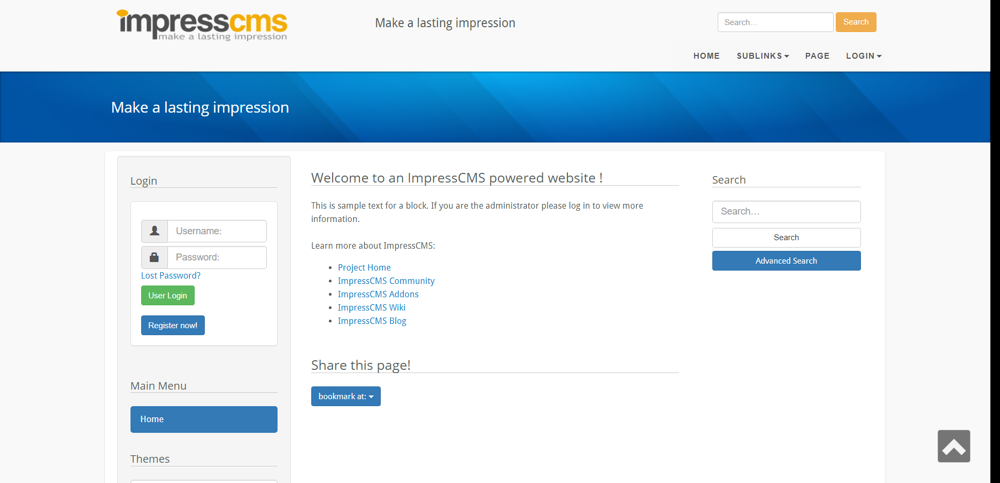
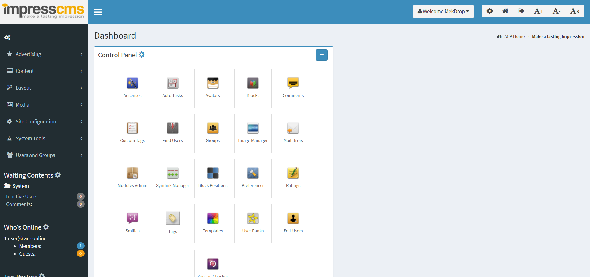

[](https://github.com/ImpressCMS/core-theme/blob/main/LICENSE)
[](https://github.com/topics/impresscms-theme)
[](https://packagist.org/packages/impresscms/core-theme)
[](https://packagist.org/packages/impresscms/core-theme)

# core theme

Admin Theme based in https://almsaeedstudio.com/.
New design based in core theme by [MrTheme](https://www.mrtheme.com).

| User side | Admin side |
| --------- | ---------- |
|  |  |

## Installation

To install and use this theme, we recommend to use [Composer](https://getcomposer.org) in [ImpressCMS](https://impresscms.org) root folder:
```bash
composer require impresscms/core-theme
```

Otherwise you need to copy all files into theme folder of your [ImpressCMS](https://impresscms.org) installation.

## How to contribute?

If you want to add some functionality or fix bugs, you can fork, change and create pull request. If you not sure how this works, try [interactive GitHub tutorial](https://skills.github.com).

If you found any bug or have some questions, use [issues tab](https://github.com/ImpressCMS/core-theme/issues) and write there your questions.
